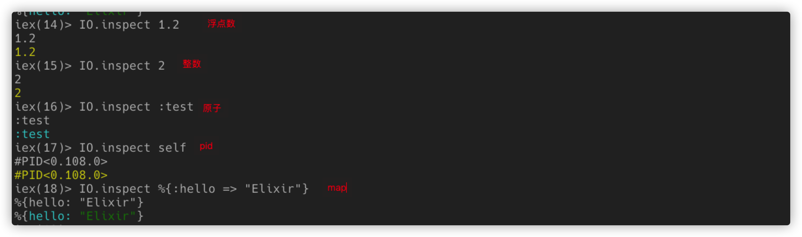
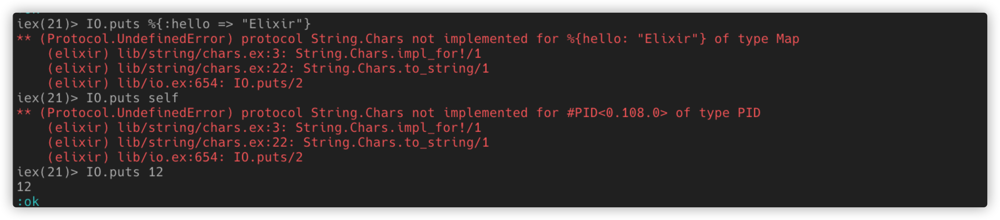
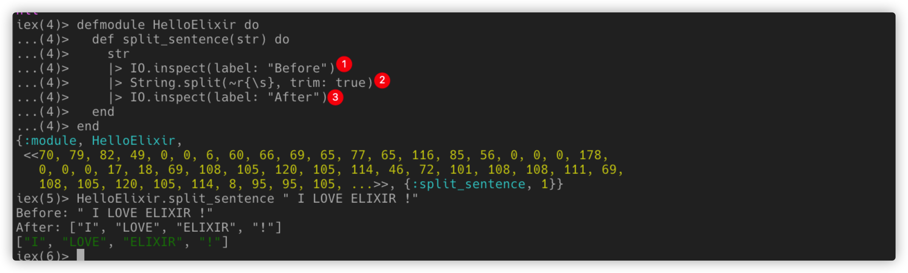
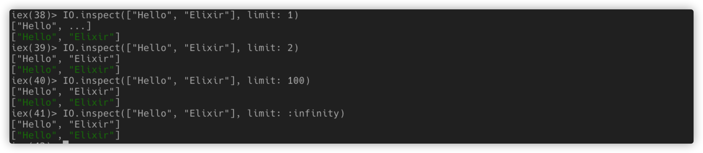
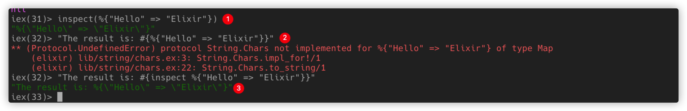

[IO.inspect/2](https://hexdocs.pm/elixir/IO.html#inspect/2)可以把调试信息直接打印到控制台上，简单易用，是不可或缺的调试好帮手。

### 基本使用

它可以打印任何的数据类型，并且可以定制protocol来打印自定义的数据。



对比[IO.puts](https://hexdocs.pm/elixir/IO.html#puts/2)，它能直接打印的数据类型就少得多了，比如：基本的数据类型，原子，字符串，`IOData`。`IO.puts`返回值为`ok`。



所以`IO.inspect`在**调试时能随意打印任何数据结构是多么的棒**!

### 使用Label选项

最棒的是此函数可以保持返回值就是输入，这可以在代码的任何地方加入它，且不影响原有代码逻辑。比如：



1. IO.inspect 可以加入`label`选项，他会直接把`label`对应内容打印在最前面。
2. 使用[String.split/3](https://hexdocs.pm/elixir/String.html#split/3)正则分割字符串。

### 使用Limit选项

限制打印的长度，允许输入0-N，或者`:infinity`。



### Kernel.inspect/2

还有一个与`IO.inspect`非常相似的函数，它就是`Kernel.inspect/2`， 这个函数不会把数据打到控制台上，它只是把参数stringify化，比如：



```elixir
iex> inspect(:foo)
    ":foo"
iex> inspect([1, 2, 3, 4, 5], limit: 3)
    "[1, 2, 3, ...]"
iex> inspect([1, 2, 3], pretty: true, width: 0)
    "[1,\n 2,\n 3]"
iex> inspect("olá" <> <<0>>)
    "<<111, 108, 195, 161, 0>>"
iex> inspect("olá" <> <<0>>, binaries: :as_strings)
    "\"olá\\0\""
iex> inspect("olá", binaries: :as_binaries)
    "<<111, 108, 195, 161>>"
iex> inspect('bar')
    "'bar'"
iex> inspect([0 | 'bar'])
    "[0, 98, 97, 114]"
iex> inspect(100, base: :octal)
    "0o144"
iex> inspect(100, base: :hex)
    "0x64"
```

