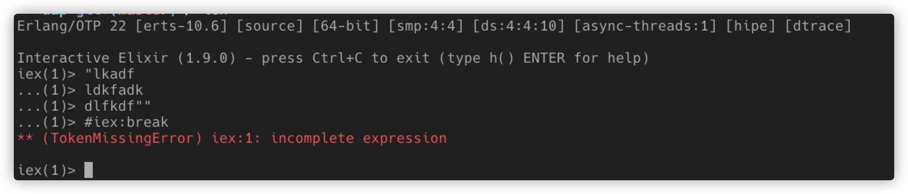
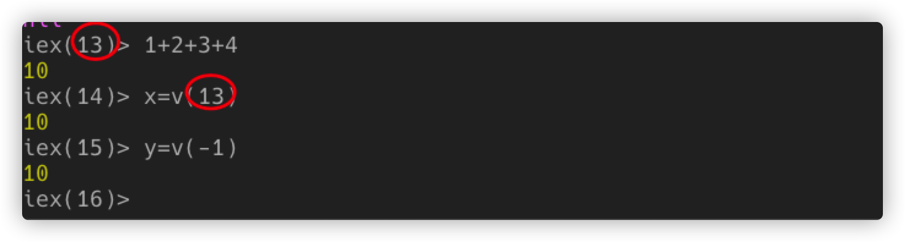
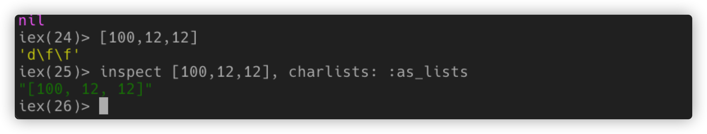

### E2.在shell中正确退出当前表达式

### 优雅退出当前表达式

在shell里面输出复杂的多行表达时，经常由于少输入一个引号，一直无法退出当前的表达式求值，也没有办法终止它，以前只能通过两次`Ctrl+C`结束这个shell，然后再开启一个新的shell，但是这样，你前的的变量和历史记录就要再来一次了，你还可以通过一个特殊的break-trigger`#iex:break`,就可以跳出当前表达式，返回正常的状态。



### 开启历史记录

```elixir
iex --erl "-kernel shell_history enabled"
```

以前在shell中输出过的表达式，只要通过翻页键就可以轻松找回来，还可以使用`Ctrl+R`直接搜索历史记录。如果你想在全局开启这个选项，直接设置全局变量：

```bash
export ERL_AFLAGS="-kernel shell_history enabled"
```

### 绑定以前表达式的结果



直接使用`v/1`+边上的序号就可以得到对应序号的表达式结果，或都使用负数，得到前多少个表达式的结果。

### 正确地显示数字列表

数字列表经常被当前ASCII码打印出来，读起来很不直观：

> Pretty-printing of lists is done by using Erlang’s native function. It is designed to print lists as strings when all elements of the list are valid ASCII codes.

可以使用charlist inspect一下。


