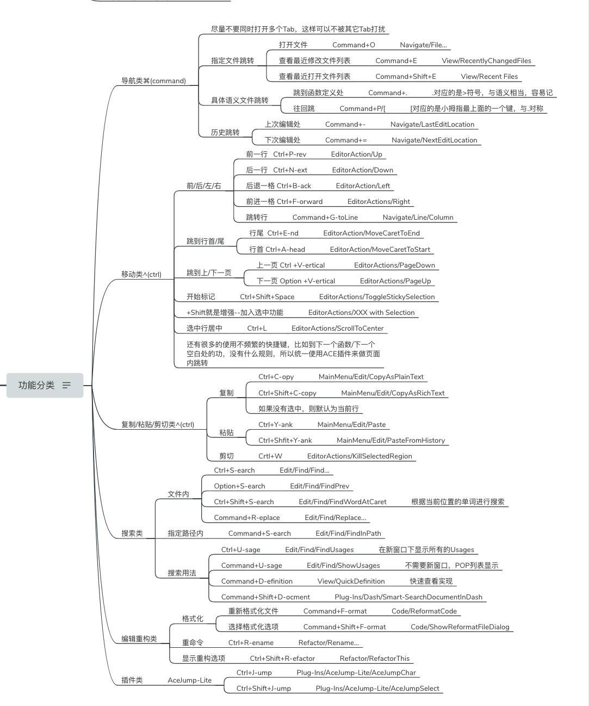
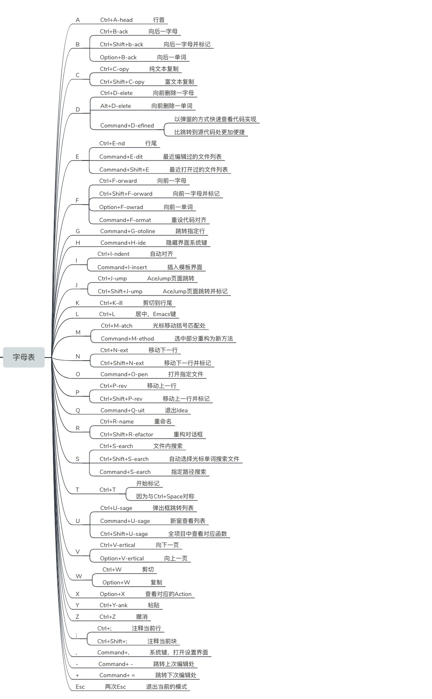

### 1. 快捷键至关重要

让一件事执行起来毫不费力，简单实用的方法就是减少执行的阻碍物。就像地面越是光滑，相同作用力物体的滑行速度越快，距离也更远。设置合理的快捷键可以有效减少写代码的拌脚石。

从2013年底开始尝试从Emacs转到IDEA，觉得它插件丰富，社区里的很多大佬也极力推荐。2年前偶然看到[42 IntelliJ IDEA Tips and Tricks（油管视频）](https://www.youtube.com/watch?v=eq3KiAH4IBI)后震惊自己把一把利剑只是当菜刀使，也不关心如何提高效率。本文的核心是**如何设置合理的快捷键来把IDEA榨干**，摸索出属于自己的工作流。

💡: **设置合理快捷键**的重要性就和五笔字根表对于五笔选手一样，选择和改造一套符合自己的字根表（借鉴前人的同时加入自己的习惯），然后牢记它的口诀，熟练后，即便彻底忘记口诀，你也能达到行云流水的状态。

### 2. 快捷键现状

IDEA keymap选项，有很多的其它系统成套的配置方案(Emacs,Mac OS X...)可供选择，我是基于Emacs上再改造的。并且在多年使用过程中随意加入了自定义的很多快捷键，整体上不伦不类，不成系统。最终效果就是一个键长时间不使用，就会被忘记。

所以我重新从零开始审视所有的IDEA的keymap，找到核心的功能，理解默认的键位，看是否必要修改为自己更容易理解和操作的。默认键位是前人的一步步实践改良，逐渐沉淀成标准，包含着**前人的智慧和经验会帮助我们少走弯路**， 这些标准值得新手学习，但不应该止步于循规蹈矩模仿标准，更要去尝试理解为什么要这样做，只有在想明白有更适合自己的时候才会去重新定义它。

### 3. 快捷键基本原则

* 同一类功能使用同一个字母，不同的修饰键决定了此功能的不同作用范围。

* 修饰键使用的优先级为为^(Ctrl) > ⌘(Command) > ⌥(Option) 。

* ⌥(Option)与^(Ctrl)相反功能的修饰键。

* ⇧ (Shift)是增强修饰键。

比如：

1. Ctrl+S(earch)是向下搜索，Option+S(earch)则是向上搜索。
2. 查看最近修改的列表是Command+E(dit)，查看最近打开的列表是Command+Shift+E(dit)。

### 4. 页面导航

| 窗口布局           | 设置                                         | 快捷键    |
| ------------------ | -------------------------------------------- | --------- |
| 回到默认的窗口布局 | Window/RestoreDefaultLayout                  | Shift+F12 |
| 上一次的窗口布局   | Window/ActiveToolWindow/JumpToLastToolWindow | F12       |

当打开太多窗口时，可以使用Shift+F12回到自己的默认布局。界面瞬间就清静了。

🙇‍♂️: 如何设置默认的布局？手动点击 Window/StoreCurrentLayoutAsDefault，这个可以不设置快捷键，设置一次后，就不会再改变。

**文件间切换**：保持只有一个Tab，不要同时打开多个Tab。保持最简洁。

```shell
Editor/General/Editor Tabs/Appearance Placement => None
```

| 文件间切换             | 设置                      | 快捷键                        |
| ---------------------- | ------------------------- | ----------------------------- |
| 打开文件               | Navigate/File...          | Command+O-pen / Ctrl+X Crtl+F |
| 查看最近修改文件列表   | View/RecentlyChangedFiles | Command+E-dit                 |
| 查看最近打开的文件列表 | View/RecentFiles          | Command+Shift+E(增加型)       |

使用上面的文件列表方便在跳出的菜单时：

* 可以直接打字搜索跳转；
* 可以多次重复按下，来选择不同的文件；
* 可以使用EditorAction/Up-Down的快捷键来跳转文件。

比在多个Tabs间切换会顺手，灵活且快很多。

| 跳转具体语义 | 设置              | 快捷键                                |
| ------------ | ----------------- | ------------------------------------- |
| 函数定义处   | View/JumpToSource | Command+.(即">"，这个符号好形象)      |
| 往回跳       | Navigate/Back     | Command+[(不能使用"<",与设置面板冲突) |

💡: JumpToSource不使用 Command+J的原因是Jump用在了下面的ACEJump的页面任务字母内跳转。

| 跳转历史编辑处 | 设置                      | 快捷键    |
| -------------- | ------------------------- | --------- |
| 上次编辑处     | Navigate/LastEditLocation | Command+- |
| 下次编辑处     | Navigate/NextEditLocation | Command+= |

###  5. 文件内移动

多年的Emacs基本操作已变成了肌肉记忆，且这些操作在Linux系列中是一致的，无需重新定义。

| 前/后/左/右 | 设置                 | 快捷键           |
| ----------- | -------------------- | ---------------- |
| 前一行      | EditorAction/Up      | Ctrl+P-rev       |
| 后一行      | EditorAction/Down    | Ctrl+N-ext       |
| 后退一字符  | EditorAction/Left    | Ctrl+B-ack       |
| 前进一字符  | EditorAction/Right   | Ctrl+F-orward    |
| 跳转指定行  | Navigate/Line/Column | Command+G-toLine |

以上所有的键+Shift就是增强加入选中，EditorActions/XXX with Selection。比如
Ctrl+P是向上一行，Ctrl+Shift+P则是Ctrl+Space后Ctrl+P的结合：标记起点并往上选中内容。

| 行首/尾 | 设置                          | 快捷键      |
| ------- | ----------------------------- | ----------- |
| 行首    | EditorAction/MoveCaretToStart | Ctrl+A-head |
| 行尾    | EditorAction/MoveCaretToEnd   | Ctrl+E-nd   |

| 扩展功能     | 设置                                | 快捷键           |
| ------------ | ----------------------------------- | ---------------- |
| 选中行居中   | EditorActions/ScrollToCenter        | Ctrl+L(Emacs)    |
| 开始标记     | EditorActions/ToggleStickySelection | Ctrl+Shift+Space |
| 自动扩展标记 | EditorActions/ExtendSelection       | Ctrl+Space       |
| 自动缩小标记 | EditorActions/ShrinkSelection       | Option+Space     |

移动还有很多扩展功能的快捷键，比如向前移动一块，或一个单词。种类繁多，选择你最常用的一组记住就得了，其它页面内的跳转都可以使用下面介绍的AceJump-Lite的2个快捷捷一并解决。

### 6. 复制/粘贴/剪切

| 复制/粘贴/剪切 | 设置                             | 快捷键                 |
| -------------- | -------------------------------- | ---------------------- |
| 复制           | MainMenu/Edit/CopyAsPlainText    | Ctrl+C-opy             |
| 增强复制       | MainMenu/Edit/CopyAsRichText     | Ctrl+Shift+C-opy(增强) |
| 粘贴           | MainMenu/Edit/Paste              | Ctrl+Y-ank             |
| 增强粘贴       | MainMenu/Edit/PasteFromHistory   | Ctrl+Shfit+Y-ank       |
| 剪切           | EditorActions/KillSelectedRegion | Ctrl+W(Emacs)          |

💡: 复制如果没有选中的话，就是默认复制当前行。

### 7. 搜索

| 文件内搜索     | 设置                      | 快捷键             |
| -------------- | ------------------------- | ------------------ |
| 向下搜索       | Edit/Find/Find...         | Ctrl+S-earch       |
| 向上搜索       | Edit/Find/FindPrev        | Option+S-earch     |
| 选当前单词搜索 | Edit/Find/FindWordAtCaret | Ctrl+Shift+S-earch |
| 替换           | Edit/Find/Replace...      | Command+R-eplace   |

Replace不用Ctrl的原因，因为被下现的Refactor占用了。Replace对我来说，不常用。

| 指定路径内搜索 | 设置                 | 快捷键          |
| -------------- | -------------------- | --------------- |
| 搜索           | Edit/Find/FindInPath | Command+S-earch |

| 搜索具体用法       | 设置                 | 快捷键              |
| ------------------ | -------------------- | ------------------- |
| 新窗口下显示Usages | Edit/Find/FindUsages | Ctrl+U-sage         |
| POP列表显示        | Edit/Find/ShowUsages | Command+U-sage      |
| 快速查看实现       | View/QuickDefinition | Command+D-efinition |

这3个快捷键使用非常频繁。根本不需要记忆。

### 8. 编辑与重构

| 编辑                 | 设置                    | 快捷键       |
| -------------------- | ----------------------- | ------------ |
| 自动调整当前行的缩进 | Code/Auto-Indent Lines  | Ctrl+I-ndent |
| 行注释               | CommentWithLineComment  | Ctrl+;       |
| 块注释               | CommentWithBlockComment | Ctrl+Shift+; |

| 重构           | 设置                        | 快捷键                |
| -------------- | --------------------------- | --------------------- |
| 重新格式化文件 | Code/ReformatCode           | Command+F-ormat       |
| 选择格式化选项 | Code/ShowReformatFileDialog | Command+Shift+F-ormat |
| 重命令         | Refactor/Rename...          | Ctrl+R-ename          |
| 显示重构选项   | Refactor/RefactorThis       | Ctrl+Shift+R-efactor  |

### 9. 五星插件推荐

[AceJump-Lite](https://plugins.jetbrains.com/plugin/9803-acejump-lite)页面内快速跳转。

| AceJumpLite | 设置                                | 快捷键           |
| ----------- | ----------------------------------- | ---------------- |
| JumpChar    | Plug-Ins/AceJump-Lite/AceJumpChar   | Ctrl+J-ump       |
| JumpSelect  | Plug-Ins/AceJump-Lite/AceJumpSelect | Ctrl+Shift+J-ump |

[Rainbow Brackets](https://plugins.jetbrains.com/plugin/10080-rainbow-brackets)让括号更加容易辨识。

#### 锦上添花的键

1. Search Everything: 全局搜索，可以连续按2下Shift，然后搜索关键字。
2. 如果只是忘记了快捷键，可以用更精确的Help/FindAction(更快)，比如：rename。
3. 使用笔记本键盘时，可以把CapsLock变成Ctrl键。缓解小拇指压力。因为习惯Emacs的指法，Ctrl是我用得最多的修饰键，原来的键位必须要用小拇指向下移，如果按多了，会发现小拇指会痛，加上CapsLock从来不使用的，所以把CapsLock改成Ctrl，会让小拇指轻松很多。
4. 一直使用命令行的Debug与版本管理git，所以我没有在Idea中设置它们。

以上说的这些快捷键，把26个字母都用上了。如果按字母来统一的话，可以为：






找到合适自己的快捷键最有效的方法是亲手**实践看效果**，而不只是简单的看演示得到的体会。

新键位需要几天的时间适应，在适应期间，速度一定会比以前的熟悉的更慢和别扭。可能还会影响到你正常的工作效率，最好的状态，每天除了工作时用外，专门腾出30分钟左右，去记忆理解，然后练习。坚持一周，情况就会有明显的好转。

欢迎大家一起交流自己使用中的各路小技巧和插件，一起持续改善。

如果你感觉对这篇的设置有点摸不到头脑（牵强），那些可以先去看看[IntelliJ-IDEA-Tutorial](https://github.com/judasn/IntelliJ-IDEA-Tutorial)，里面关于IDEA的中文资料非常全面，重点是理解这些快捷键，而不是死记。

### 10.参考资源

* [42 IntelliJ IDEA Tips and Tricks](https://www.youtube.com/watch?v=eq3KiAH4IBI)
* [从零开始IntelliJ-IDEA的中文资料](https://github.com/judasn/IntelliJ-IDEA-Tutorial)
* [简化提速版本的AceJumpLite，原版本的AceJump太卡了](https://plugins.jetbrains.com/plugin/9803-acejump-lite)
* [让各类括号更具辨识度的rainbow-brackets](https://plugins.jetbrains.com/plugin/10080-rainbow-brackets)