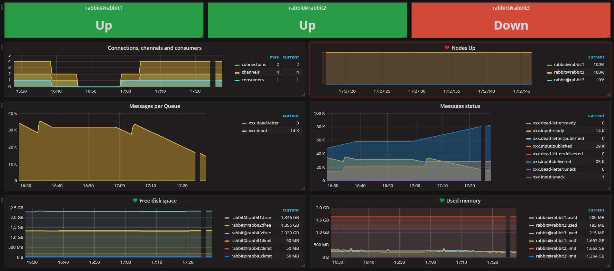
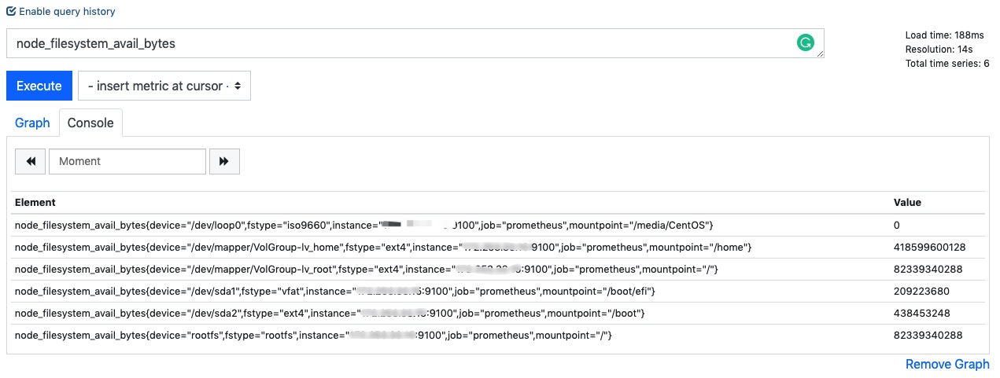

### Prometheus

Prometheus和Grafana组合基本上是监控系统的标配。Prometheus做存储后端，Grafana做分析及可视化界面。



[普罗米修斯](https://prometheus.io)是开源的系统监控/报警工具库，功能非常全，且拥有活跃的开发者和[用户社区](https://prometheus.io/community/)。Prometheus通过HTTP**定期主动拉取**(Pull)的方式获得指标(直接获取或通过gateway推送)，在本地存储所有抓取的样本，并对这些数据运行规则，从现有数据聚合和记录新的时间序列，或生成警报。

Prometheus原生的可视化界面做得比较原始(主要用于调试)，所以社区(官方推荐)使用[Grafana](https://grafana.com/)来做数据展示。

[Grafana](https://grafana.com/)专注于数据展示，有着丰富用成熟的展示方式和插件，数据源支持Elasticsearch, Prometheus, Graphite, InfluxDB等等。可以让你通过界面点击(无需写前端代码)快速搭建一个非常专业漂亮的展示界面。即便对于前端零基础的开发者也非常友好！

### 安装Prometheus

1. 在[官网](https://prometheus.io/download/)下载需要的版本(`uname -rv`查看linux内核版本及发行号)。比如x86的就下载linux-386系列。

2. Prometheus会主动通过HTTP请求来收集受监控目标的指标。 比如它也通过HTTP Rest API导出了自己的健康状态数据，所以也可以用来监控自己。解压下载源文件内包含一个基本的`prometheus.yml`配置可以参照。配置非常简单。

   ```yaml
   global: # 全局配置
     scrape_interval:     15s #主动拉取指标的间隔
     evaluation_interval: 15s #计算间隔
   
   scrape_configs: #监控的目标配置
     - job_name: prometheus #名称 
       static_configs: # 静态配置
         - targets: ['127.0.0.1:9090'] #监控目标暴露的HTTP API端口，是个列表
   ```

   * 把里面的<u>localhost</u>改成你对应机器的IP。
   * 其它详细的配置可见[配置文档](https://prometheus.io/docs/prometheus/latest/configuration/configuration/)。

3. 前台启动Prometheus，如果是在生产环境，需要后台启动时，最好自行配置[Systemd](https://www.wikiwand.com/en/Systemd)。

   ```shell
   # Start Prometheus.
   # By default, Prometheus stores its database in ./data (flag --storage.tsdb.path).
   ./prometheus --config.file=prometheus.yml
   ```

4. 用浏览器打开http://IP:9090/metrics查询所有指标列表。

5. 用浏览器打开http://IP:9090/graph，原生的简易的展示界面(太简陋了，基本没人会用)。
   PS：因为Promethues自己导出的指标和展示界面都是同一个9090端口。但实践中metrics接口指向的是目标机器的指标列表，用于Promethues主动拉取。

丰富的[Exporter](https://prometheus.io/download/)可以下载使用，开箱即用。下面可以用[NodeExporter](https://github.com/prometheus/node_exporter)来做个范例。

### 安装NodeExporter

[NodeExporter](https://github.com/prometheus/node_exporter)暴露很多和硬件/软件相关的指标(metrics)。

* 直接[下载对应的版本](https://github.com/prometheus/node_exporter/releases)。

* 解压NodeExporter。

1. ```shell
   $ tar xvfz node_exporter-*
   $ cd node_exporter-*
   ```

* 启动NodeExporter。

  ```shell
  $ ./node_exporter
  INFO[0000] Starting node_exporter (version=0.18.1, branch=HEAD, revision=3db77732e925c08f675d7404a8c46466b2ece83e)  source="node_exporter.go:156"
  INFO[0000] Build context (go=go1.12.5, user=root@b50852a1acba, date=20190604-16:41:43)  source="node_exporter.go:157"
  INFO[0000] Enabled collectors:   source="node_exporter.go:97"
  INFO[0000]  - arp                source="node_exporter.go:104"
  ...
  INFO[0000] Listening on :9100    source="node_exporter.go:170"
  ```

  可以使用`./node_exporter -h`查看具体的启动参数。从上面可以看它使用的端口是9100，所有的指标列表都可以和上面示例中的prometheus的接口一样：

  ```shell
  $ curl http://localhost:9100/metrics
  # HELP go_gc_duration_seconds A summary of the GC invocation durations.
  # TYPE go_gc_duration_seconds summary
  go_gc_duration_seconds{quantile="0"} 2.8138e-05
  go_gc_duration_seconds{quantile="0.25"} 4.1588e-05
  go_gc_duration_seconds{quantile="0.5"} 0.000102923
  go_gc_duration_seconds{quantile="0.75"} 0.000162106
  go_gc_duration_seconds{quantile="1"} 0.000495923
  go_gc_duration_seconds_sum 0.060153937
  go_gc_duration_seconds_count 537
  # HELP go_goroutines Number of goroutines that currently exist.
  ...
  ```

  可以看到所有关于node_exporter的指标列表。接下来就是把让prometheus来取这些指标。

* 配置prometheus拉node exporter的指标。即把targets增加9100端口。

  ```yaml
  scrape_configs:
  - job_name: 'node'
    static_configs:
    - targets: ['127.0.0.1:9100']
  ```

* 重启prometheus。

  ```shell
  ./prometheus --config.file=./prometheus.yml
  ```

  再次查看浏览器打开graph查看：http://127.0.0.1:9090/graph。勾选`Enable query history`后直接输入以node就可以看到大量关于node为前缀的指标了。比如：`node_filesystem_avail_bytes`查看文件系统可用空间大小情况。

​      

这个界面还是太原始了，但可以用来体验一下[PromQL](https://prometheus.io/docs/prometheus/latest/querying/basics/)。接下来演示一下接入grafana来展示这些数据。

### 安装Grafana

按[官方指引](https://grafana.com/grafana/download)下载安装:比如Centos安装是

```shell
$ wget https://dl.grafana.com/oss/release/grafana-6.3.3-1.x86_64.rpm 
$ sudo yum localinstall grafana-6.3.3-1.x86_64.rpm 
```

### 配置grafana

你可以在`/etc/grafana/grafana.ini`中配置端口及其它的，具体所有的配置项在： https://grafana.com/docs/installation/configuration/，我们这里都保持默认值，端口默认为3000.用户名/密码默认为*admin*。

你可以在[这里找到对应的启动方式](https://grafana.com/docs/installation/)，比如在CentOS上就是

```shell
sudo service grafana-server start
```

启动成功后，你可以使用浏览器打开http://IP:3000使用admin/admin登录。

### 创建界面

#### Prometheus的数据源(data  source)

* 点击侧边栏中的Grafana图标 -> DataSources -> Add New
* 选择Prometheus类型.
* 设置Prometheus的对外URL（比如 http://IP:9090).
* 点击Add添加


#### Prometheus图表展示

* 点击graph标题 --> Edits.
* 在Metrics标签下选择你上一步刚增加的Prometheus数据库。
* 在Query字段中输入Prometheus表达式，会自动补全。
* 自定义图表横坐标中指标的名称： Legend format。


### 导入Dashboards

Grafana.com上有[很多别人分享的优化的dashboards](https://grafana.com/dashboards)，我们可以直接从上面找到node exporter对应的dashboard来使用。下载[对应的json文件](https://grafana.com/grafana/dashboards/10645)，然后导入。

### 其它

在Grafana上如何为选择合适的图表来展示Prometheus对应的数据类型[(单调递增的Counter,可降可升的Gauge,用于柱状图展示的Histogram),提供滑动窗口求和的Summary](https://prometheus.io/docs/concepts/metric_types/)。

### Reference

* [Node Exporter](https://prometheus.io/docs/guides/node-exporter/).

* [Grafana Visualization](https://prometheus.io/docs/visualization/grafana/).

* [Ansible直接安装一条龙](https://github.com/MiteshSharma/PrometheusWithGrafana).

* [Console Dashboards最佳实践]( https://prometheus.io/docs/practices/consoles/).